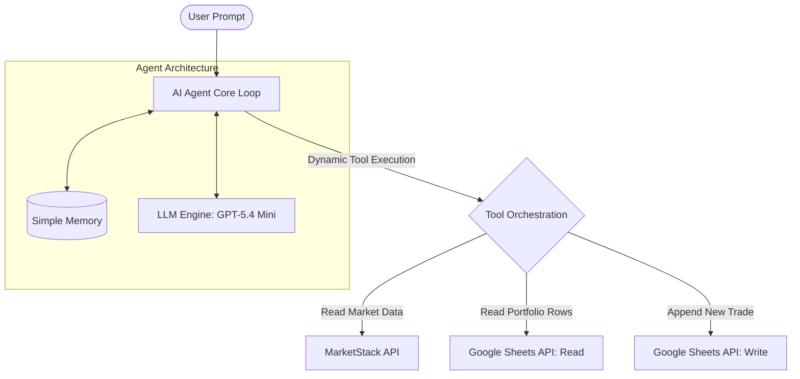
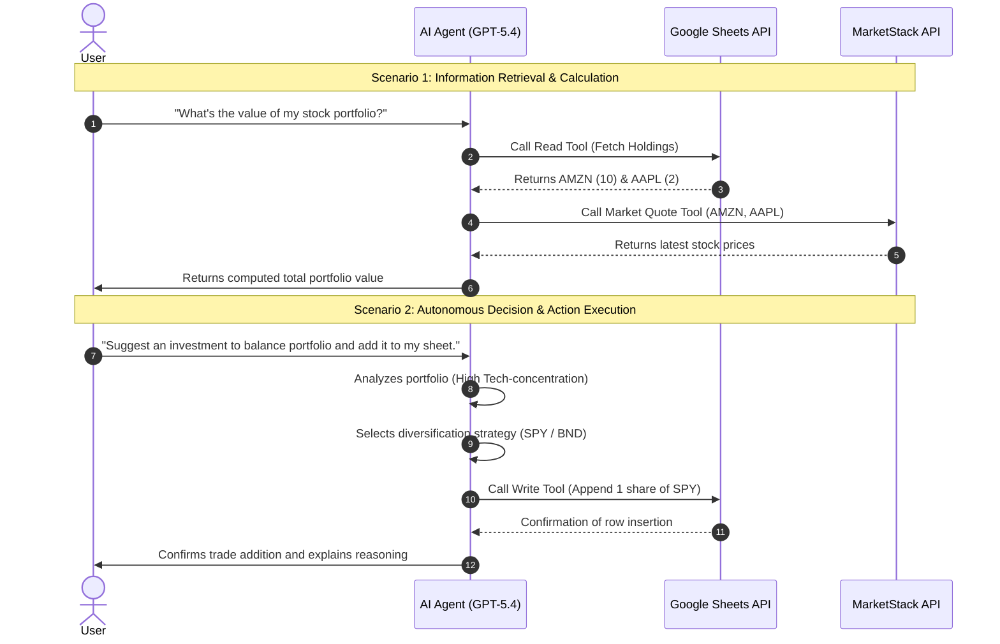

# Lecture Notes: Introduction to Agentic AI & Autonomous Agents

**Course:** AI Engineer Agentic Track (Week 1, Day 1)  
**Topic:** Foundations of Agentic AI, Autonomous Execution, and Tool Calling  
**Delivery Method:** Interactive Demonstration & Conceptual Overview  

---

## Executive Summary

This lecture establishes the foundational framework for **Agentic AI**. It shifts the software development paradigm from traditional single-turn Large Language Model (LLM) interactions (e.g., standard prompt-response chats) to **autonomous agents** capable of executing loops, reasoning dynamically, and interacting with external environments via executable tools.

---

## System Architecture

## 3. Practical Architecture Demonstration: Portfolio Balancing Agent

To demonstrate true agent autonomy, an n8n agentic workflow was constructed using **three discrete tools**:

1. **MarketStack API Tool (Read):** Fetches real-time stock price quotes for any stock ticker symbol.
2. **Google Sheets Read Tool (Read):** Queries a target spreadsheet (`Investments`) to retrieve existing holdings (e.g., 10 shares of Amazon, 2 shares of Apple).
3. **Google Sheets Write Tool (Write):** Appends new rows to the spreadsheet, using dynamic parameter generation by the LLM (Ticker symbol and Share quantity).

---

## 4. Execution Step Walkthrough & Decision Logic

