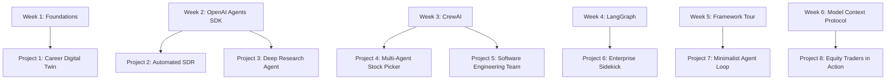
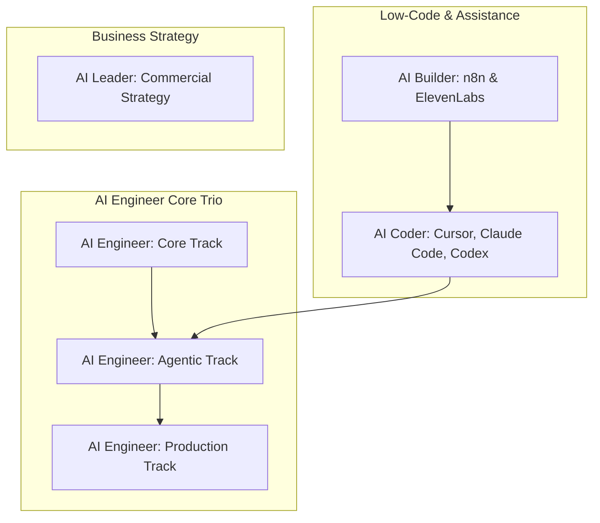

# Lecture Notes: AI Engineer Agentic Track — Curriculum & Architecture

**Instructor:** Ed Donner  
**Course:** AI Engineer Agentic Track (Week 1, Day 1 - Part 2)  
**Topic:** 6-Week Curriculum Overview, Framework Matrix, & Project Roadmap  

---

## Executive Summary

This lecture establishes the core scope of the **AI Engineer Agentic Track**. Rather than relying on low-code/no-code drag-and-drop tools, this course focuses strictly on **code-native agent engineering** using Python and TypeScript. 

The curriculum balances three core pillars:
1. **Theory & Architecture:** Design patterns, autonomous loops, and the Model Context Protocol (MCP).
2. **Framework Mastery:** In-depth implementation and comparison of major industry frameworks (OpenAI Agents SDK, CrewAI, LangGraph, Google ADK, AWS Strands).
3. **Commercial Production:** Building 8 full-stack, enterprise-grade AI agent deliverables.

---

## 6-Week Curriculum Matrix

| Week | Framework / Tech | Core Focus & Major Project Deliverable |
| :--- | :--- | :--- |
| **Week 1** | Agentic Foundations | Theory, Loops, Design Patterns, Career Digital Twin |
| **Week 2** | OpenAI Agents SDK | Automated SDR (Sales) & Deep Research Agent |
| **Week 3** | CrewAI | Multi-Agent Stock Picker & Autonomous Dev Team |
| **Week 4** | LangGraph | Enterprise Sidekick Agent (Bulletproof Workflows) |
| **Week 5** | Multi-Framework Tour | Google ADK, AWS Strands, JS/TS & Agent Loop |
| **Week 6** | MCP Protocol | Grand Finale: Production Equity Trading System |

---

## Weekly Breakdown & Portfolio Projects

# Lecture Notes: Instructor Profile, Course Ecosystem & Learning Paths

**Instructor:** Ed Donner  
**Course:** AI Engineer Agentic Track (Week 1, Day 1 - Part 3)  
**Topic:** Instructor Background, Full Curriculum Mapping, and Recommended Onboarding Paths  

---

## 1. Instructor Profile & Experience

* **Current Roles:** Co-Founder & CTO at `aistartupnebula.io` | Top-rated AI Instructor (~600,000 enrolled students across 6 courses).
* **Enterprise Background:** Former Managing Director at **J.P. Morgan** leading an organization of ~300 software engineers and data scientists across London, Tokyo, and New York City.
* **Entrepreneurial Track Record:** Founder of AI startup **Untapped** (acquired).

<Image src="image_agent_tag_3739713579821577265" alt="Times Square New York" caption="Times Square, New York City - Location of Untapped Startup Acquisition Announcement" />

---

## 2. Course Ecosystem Architecture

Ed Donner's curriculum consists of 6 interconnected courses designed to take developers from non-coders to enterprise AI Engineers:

| | |
| :--- | ---: |
| [**← Introductin to Agentic AI**](./01. .md) | [**Next to Tailoring Your Wellfound Profile →**](./02.tailoring-wellfound-profile.md) |
