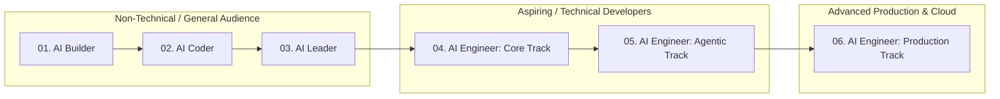

# Lecture Notes: Your Path to Becoming a Proficient AI Engineer

**Instructor:** Ed Donner  
**Course:** AI Engineer Agentic Track (Week 1, Day 1 - Module 3)  
**Topic:** AI Curriculum Overview, Career Learning Paths, & Course Selection Strategy  

---

## Executive Summary

This lecture details the complete 6-course **AI Engineering Curriculum** designed by Ed Donner. It maps out how non-technical, aspiring technical, and experienced software engineers can navigate the curriculum to become **Proficient AI Engineers** capable of shipping commercial AI systems, autonomous agents, and enterprise-scale cloud deployments.

---

## 1. The 6-Course AI Curriculum Breakdown

The curriculum is structured into three foundational courses and a three-part **AI Engineering Trio**:

| # | Course Name | Primary Focus & Target Audience | Post-Course Capabilities |
| :--- | :--- | :--- | :--- |
| **01** | **AI Builder** | No-Code Agents & Voice Bots (`n8n`, `ElevenLabs`)  *Audience: Technical & Non-Technical* | Build autonomous agents and voice bots without writing code. |
| **02** | **AI Coder** | AI-Assisted Software Development (`Claude Code`, `Cursor`)  *Audience: Technical & Non-Technical* | Deliver software products rapidly using AI coding assistants. |
| **03** | **AI Leader** | AI Strategy, Transformation & Commercial Projects  *Audience: Technical & Non-Technical* | Drive business impact, manage AI projects, or launch AI startups. |
| **04** | **AI Engineer: Core Track** | LLMs, APIs, Open Source Models, RAG & Fine-Tuning  *Audience: Aspiring Technical & Technical* | Select, optimize, and evaluate LLMs for real-world business cases. |
| **05** | **AI Engineer: Agentic Track** | **(THIS COURSE)** Autonomous Loops, SDKs, MCP  *Audience: Aspiring Technical & Technical* | Build autonomous code-native agents with tools and memory. |
| **06** | **AI Engineer: Production Track**| Scalable Cloud Deployments (AWS, GCP, Azure)  *Audience: Technical / Completed Courses 1–5* | Deploy resilient, observable, and secure AI systems at scale. |

---

## 2. Technical Progression Spectrum

| | |
| :--- | ---: |
| [**← 03. AI Engineer Path**](./02.course-roadmap.md) | [**04. Environment Setup →**](./04.environment-setup.md) |
